<p align="center">
  
</p>

<p align="center">
  
</p>

<p align="center">
  
</p>

<p align="center">
  <a href="https://engrgab.gt.tc"></a>
  <a href="https://www.linkedin.com/in/gabriel-andrei-villanueva-56494337a/"></a>
  <a href="mailto:cpe.villanueva.gabrielandrei@gmail.com"></a>
  <a href="https://github.com/gabbygab18?tab=repositories"></a>
</p>

<p align="center">
  
  
</p>


<p align="center"></p>

<h2 align="center">&nbsp; About Me</h2>

<p align="center">
<i>I build real-world web projects, craft compelling brand visuals, and turn ideas into<br/>
clean, functional digital experiences. Early in my career but always learning, always shipping.</i>
</p>

```js
const gabbygab = {
  name:      "Gabriel Andrei Villanueva",
  role:      "Full Stack Developer | Graphic Designer | UI/UX Designer",
  education: "BS Computer Engineering, Pamantasan ng Lungsod ng San Pablo (2022-2026)",
  currently: "Isla Outsourcing Solutions",
  frontend:  ["react.js", "vue", "angular", "typescript", "tailwind", "sass"],
  backend:   ["php", "laravel", "express", "mysql", "postgresql"],
  baas:      ["supabase", "firebase"],
  devops:    ["linux", "docker", "github actions"],
  design:    ["figma", "photoshop", "premiere pro"],
  portfolio: "https://engrgab.gt.tc",
  status:    "available for freelance"
};
```


<p align="center"></p>

<h2 align="center">&nbsp; toolbox</h2>
<p align="center"><sub> click a group to see what I work with</sub></p>

<details>
<summary><b>&nbsp;&nbsp; frontend</b></summary>
<br/>

<p align="center">
  
</p>

</details>

<details>
<summary><b>&nbsp;&nbsp; backend</b></summary>
<br/>

<p align="center">
  
</p>

</details>

<details>
<summary><b>&nbsp;&nbsp; devops</b></summary>
<br/>

<p align="center">
  
</p>

</details>

<details>
<summary><b>&nbsp;&nbsp; design</b></summary>
<br/>

<p align="center">
  
</p>

</details>

<details>
<summary><b>&nbsp;&nbsp; tools</b></summary>
<br/>

<p align="center">
  
</p>

</details>


<p align="center"></p>

<h2 align="center">&nbsp; experience</h2>

<details>
<summary><b>&nbsp;&nbsp; 6 roles since 2022</b></summary>
<br/>

<table>
  <tr>
    <td valign="top" align="right" nowrap><b>2026 &ndash; Present</b></td>
    <td valign="top"><b>Full Stack Developer | Social Media Marketing Officer</b><br/><sub>Isla Outsourcing Solutions</sub><br/><br/>Build and maintain the company's client and staff portals and core web platform across the full stack, while managing social content and campaigns that support brand visibility and lead generation.</td>
  </tr>
  <tr>
    <td valign="top" align="right" nowrap><b>2026</b></td>
    <td valign="top"><b>Full Stack Developer</b><br/><sub>Monte Carlo Technologies</sub><br/><br/>Developed and maintained web application features across the full stack, contributing clean, scalable code in a fast-paced, collaborative environment.</td>
  </tr>
  <tr>
    <td valign="top" align="right" nowrap><b>2025 &ndash; Present</b></td>
    <td valign="top"><b>Graphic Designer</b><br/><sub>Sweet Ghen</sub><br/><br/>Created sticker designs and branding materials for a range of food products &mdash; chips, pastillas and sampaloc candies &mdash; keeping one visual identity across the product line.</td>
  </tr>
  <tr>
    <td valign="top" align="right" nowrap><b>2025</b></td>
    <td valign="top"><b>Freelance Full Stack Developer</b><br/><sub>Self Employed</sub><br/><br/>Designed and built custom web applications for clients, translating requirements into responsive interfaces with clean backend logic following MVC and RESTful API principles. Ran the full project lifecycle solo, then deployed and maintained the work on cPanel hosting and live domains.</td>
  </tr>
  <tr>
    <td valign="top" align="right" nowrap><b>2022</b></td>
    <td valign="top"><b>Social Media Manager</b><br/><sub>Hayde Perfume</sub><br/><br/>Planned and executed content strategies, created on-brand visuals, and managed community engagement to grow Hayde Perfume's presence across social platforms.</td>
  </tr>
  <tr>
    <td valign="top" align="right" nowrap><b>2022</b></td>
    <td valign="top"><b>Freelance Graphic Designer</b><br/><sub>Self Employed</sub><br/><br/>Designed brand identities, logos and visual materials for clients across several industries, delivering purposeful creative work from concept to final output.</td>
  </tr>
</table>

</details>


<p align="center"></p>

<h2 align="center">&nbsp; stats</h2>

<p align="center">
  
</p>


<p align="center"></p>

<h2 align="center">&nbsp; snake eats my commits</h2>

<p align="center">
  <picture>
    <source media="(prefers-color-scheme: dark)" srcset="https://raw.githubusercontent.com/gabbygab18/gabbygab18/output/github-snake-dark.svg" />
    <source media="(prefers-color-scheme: light)" srcset="https://raw.githubusercontent.com/gabbygab18/gabbygab18/output/github-snake.svg" />
    
  </picture>
</p>


<p align="center"></p>

<h2 align="center">&nbsp; hire me</h2>

<p align="center">
open for <b>freelance</b> &mdash; web builds, landing pages, branding, thumbnails, video edits.
</p>

<p align="center">
  <a href="mailto:cpe.villanueva.gabrielandrei@gmail.com"></a>
  <a href="https://engrgab.gt.tc"></a>
</p>

<p align="center">
  
</p>

<p align="center">
  <sub> thanks for scrolling</sub>
</p>

